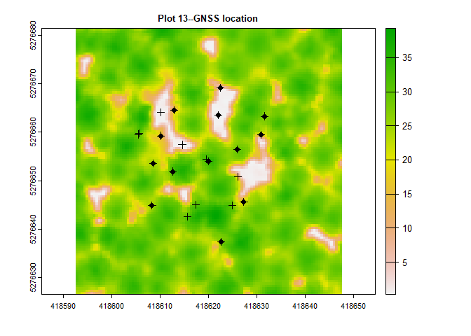
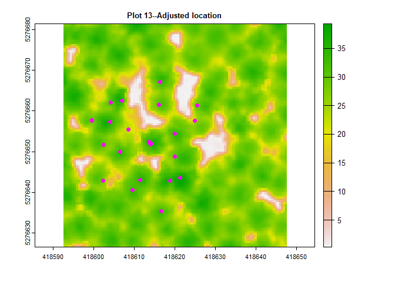

<!-- README.md is generated from README.Rmd. Please edit that file -->

# PlotLocatoR

<!-- badges: start -->
<!-- badges: end -->

The PlotLocatoR package is designed to help georeference forestry field
plot data. These data should include stem-mapped trees with either XY
locations for trees or a distance and azimuth from plot center to each
tree. The main objetive of teh package is to align stem-mapped tree data
with a lidar-derived anopty height model (CHM). The initial plot
locations need to be “close”. That is, within \~10m of true locations.
Locations can be farther off but the brute force search method
implemented in the package will be extremely slow when searching for a
pattern match over a large area.

## Installation

This package is only distributed from my GitHub account. It may make it
to CRAN at some point but no promises.

~~You can install the released version of PlotLocatoR from
[CRAN](https://CRAN.R-project.org) with:~~

``` r
#install.packages("PlotLocatoR")
```

**PlotLocatoR** is currently available as a development version only.
The **devtools** package is required to install **PlotLocatoR**. If you
have not previously used **devtools**, use the commented line of code to
install the package. Note that this will also install several additional
packages needed for devtools. If you do not want the vignettes, set
*build_vignettes = FALSE*.

You can install the development version from
[GitHub](https://github.com/) with:

``` r
# install.packages("devtools")
library(devtools)
devtools::install_github("bmcgaughey1/PlotLocatoR", build_vignettes = TRUE)
```

## Example

The PlotLocatoR package includes sample data for a plot and a canopy
height model (CHM) clipped to cover the area containing the “best” plot
location. The CHM was created from high density lidar data (1000+
pulses/m<sup>2</sup>) collected from a UAS platform. CHM resolution is
0.5m. The initial plot location was collected with a survey-grade GNSS
receiver (Javad Triumph 2). Under test conditions, this receiver can
collect location data accurate to \~1m in forest conditions with a
15-minute occupation time and 1-second epochs. However, for this plot,
the location was off by several meters.

The objective of this example is to improve the plot location. For the
field data, distance was measured to the center of the stem and azimuth
included local declination. Tree heights were predicted using an
equation developed from field DBH and lidar-derived tree heights. In
practice, dominant and co-dominant trees should produce the best match
but it really depends on the forest type, slope and tree lean. The field
protocol used to collect the field data included a special attribute for
each tree indicating whether or not the tree was visible from above
(LiDAR_visible). This attribute was used to select the trees used for
the location search.

``` r
library(PlotLocatoR)

# load the plot data
P13Field <- read.csv("data/plot13.csv", 
                     header = TRUE,
                     stringsAsFactors = FALSE)

# this is the plot location from GNSS in UTM NAD83 zone 10 (EPSG:26910)
plotX <- 418620.0
plotY <- 5276654.0

# create the stem map from the field data and the GNSS location
P13_map <- PlotLocatoR::computeLocalTreePositions(P13Field,
                                                  plotX,
                                                  plotY,
                                                  azLabel = "Azimuth",
                                                  distLabel = "Distance",
                                                  dbhLabel = "DBH_cm"
                                                  )

# bind XY locations to plot data
P13 <- data.frame(P13Field, P13_map)

# sort by decreasing height
P13 <- P13[order(-P13$Ht_m),]

# select 10 tallest trees
#P13FieldSubset <- P13[1:10,]

# select trees based on the LiDAR_visible attribute
P13FieldSubset <- P13[P13$LiDAR_visible == "Y",]

# read the CHM into a terra SpatRaster object
CHM <- terra::rast("data/Plot13_CHM.tif")

# plot the CHM with the original stem map and plot location
terra::plot(CHM, main = "Plot 13--GNSS location")
points(plotX, plotY, pch = 3, col = "red")
points(P13$Xfield, P13$Yfield, pch = 3, col = "black")
points(P13FieldSubset$Xfield, P13FieldSubset$Yfield, pch = 19, col = "black")

# perform a brute-force assessment of alternate plot locations
# grid resolution for possible locations will match the cell size of the CHM
sr <- testPlotLocations(
  P13FieldSubset,
  coords = c("Xfield", "Yfield"),
  htField = "Ht_m",
  plotX = plotX,
  plotY = plotY,
  plotRadius = 17.68,
  treeBufferSize = 1,
  crs = 26910,
  CHM = CHM,
  searchRadius = 7,
  progress = FALSE
)
```

<!-- -->

``` r

# get the index of the best location
bestIndex <- findBestPlotLocation(sr, rule = "combined")

# compute new plot location
plotXAdj <- plotX + sr$offsetX[bestIndex]
plotYAdj <- plotY + sr$offsetY[bestIndex]

# compute new tree locations using adjusted plot location
P13_mapAdj <- PlotLocatoR::computeLocalTreePositions(P13Field,
                                                  plotXAdj,
                                                  plotYAdj,
                                                  azLabel = "Azimuth",
                                                  distLabel = "Distance",
                                                  dbhLabel = "DBH_cm"
                                                  )
# bind XY locations to plot data
P13Adj <- data.frame(P13Field, P13_mapAdj)

# plot everything
terra::plot(CHM, main = "Plot 13--Adjusted location")
points(P13Adj$Xfield, P13Adj$Yfield, pch = 19, col = "magenta")
points(plotXAdj, plotYAdj, pch = 9, col = "magenta")
```

<!-- -->
